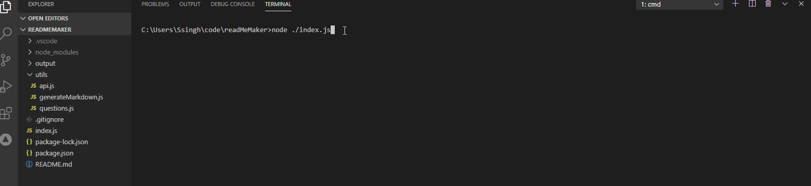

# readMeMaker

## Table of Contents

- [Description](#Description)
- [Installation](#Installation)
- [Usage](#Usage)
- [Credits](#Credits)
- [License](#License)
- [Contributing](#Contributing)
- [Tests](#Tests)
- [Questions](#Questions)

## Description

Creates a readme file based on user input

## Installation

- run npm install
- run node ./index.js

## Usage

run node./index.js and follow the prompts on your screen. Your readme file will be placed in the 'output' directory. The readme file will be titled same as your projectname.

## Credits

sandyboon(https://github.com/sandyboon)

## License

Licensed under the MIT license.

## Contributing

Contribution to this project is not permitted at this moment.

## Tests

There are no tests at this moment.

## Questions

### Email : hidden

